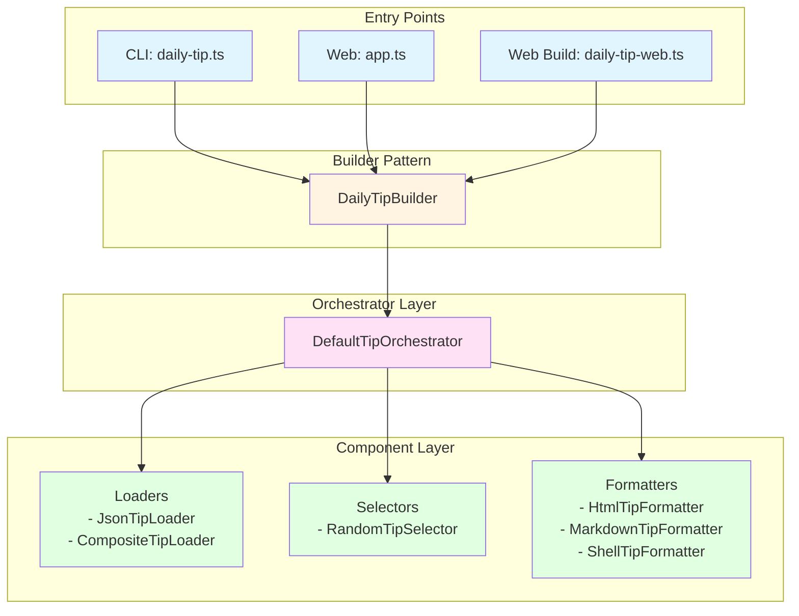
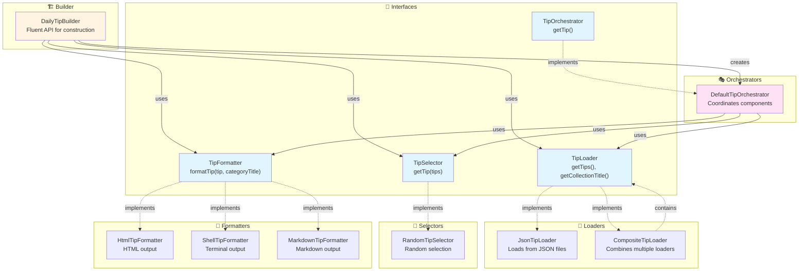
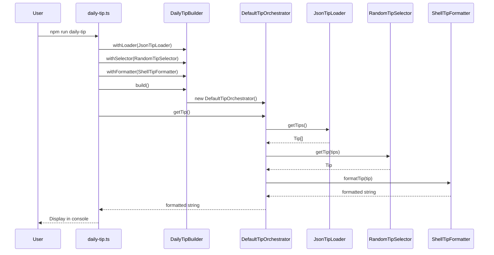
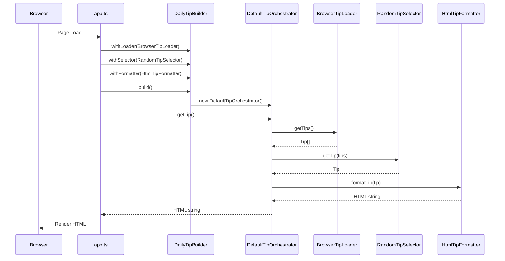

# Architecture Overview

## System Architecture

The Daily Tip application follows a clean, layered architecture with clear separation of concerns.



## Component Relationships



## Core Components

### 1. Loaders (`src/loaders/`)
**Responsibility**: Load tips from various sources

- `JsonTipLoader`: Loads tips from JSON files
- `CompositeTipLoader`: Combines multiple loaders (Composite Pattern)
- `PoisonTipLoader`: Test double for error scenarios

**Interface**: `TipLoader`
```typescript
interface TipLoader {
  getTips(): Tip[];
  getCollectionTitle?(): string;
}
```

### 2. Selectors (`src/selectors/`)
**Responsibility**: Choose which tip to display

- `RandomTipSelector`: Selects a random tip
- `PoisonTipSelector`: Test double for error scenarios

**Interface**: `TipSelector`
```typescript
interface TipSelector {
  getTip(tips: Tip[]): Tip;
}
```

### 3. Formatters (`src/formatters/`)
**Responsibility**: Format tips for different output mediums

- `HtmlTipFormatter`: Formats tips as HTML (for web)
- `MarkdownTipFormatter`: Formats tips as Markdown
- `ShellTipFormatter`: Formats tips for terminal with colors
- `PoisonTipFormatter`: Test double for error scenarios

**Interface**: `TipFormatter<T>`
```typescript
interface TipFormatter<T> {
  formatTip(tip: Tip, categoryTitle?: string): T;
}
```

### 4. Orchestrators (`src/orchestrator/`)
**Responsibility**: Coordinate the entire tip generation process

- `DefaultTipOrchestrator`: Standard orchestration flow
- `PoisonTipOrchestrator`: Test double for error scenarios

**Interface**: `TipOrchestrator<T>`
```typescript
interface TipOrchestrator<T> {
  getTip(): T;
}
```

### 5. Builder (`src/index.ts`)
**Responsibility**: Fluent API for constructing the tip system

- `DailyTipBuilder`: Builder pattern implementation

## Data Flow

### CLI Flow



### Web Flow



## Key Design Decisions

### 1. Interface-Based Design
All major components are defined by interfaces, allowing for:
- Easy testing with mock implementations
- Runtime polymorphism
- Loose coupling between components

### 2. Immutable Data Types
`Tip` and `TipCollection` are readonly, ensuring:
- Data integrity
- Predictable behavior
- Thread safety (if needed in future)

### 3. Separation of Concerns
Each layer has a single, well-defined responsibility:
- Loaders: Data acquisition
- Selectors: Selection logic
- Formatters: Presentation logic
- Orchestrators: Coordination

### 4. Dependency Injection
Components receive their dependencies through constructors:
- Testability
- Flexibility
- Explicit dependencies

## Extension Points

### Adding a New Loader
```typescript
export class ApiTipLoader implements TipLoader {
  constructor(private apiUrl: string) {}
  
  getTips(): Tip[] {
    // Fetch from API
  }
  
  getCollectionTitle(): string {
    return "API Tips";
  }
}
```

### Adding a New Formatter
```typescript
export class JsonTipFormatter implements TipFormatter<string> {
  formatTip(tip: Tip, categoryTitle?: string): string {
    return JSON.stringify({ tip, categoryTitle }, null, 2);
  }
}
```

### Adding a New Selector
```typescript
export class SequentialTipSelector implements TipSelector {
  private index = 0;
  
  getTip(tips: Tip[]): Tip {
    const tip = tips[this.index];
    this.index = (this.index + 1) % tips.length;
    return tip;
  }
}
```

## Testing Strategy

- **Unit Tests**: Each component tested in isolation
- **Integration Tests**: Orchestrator tests verify component interaction
- **Test Doubles**: Poison implementations for error scenarios
- **Mock Data**: JSON fixtures for consistent test data
